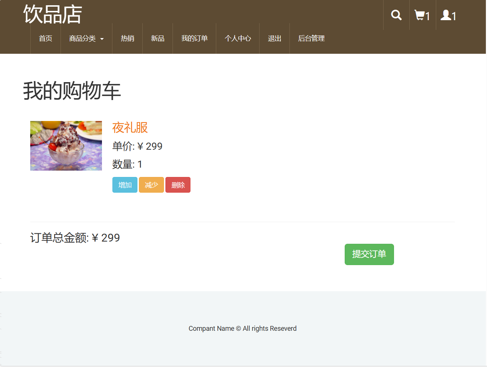

<h1 align="center">20.基于ssm的蛋糕商城管理系统</h1>

- <b>完整代码获取地址：从戎源码网 ([https://armycodes.com/](https://armycodes.com/))</b>
- <b>技术探讨、资料分享，请加QQ群：692619798</b> 
- <b>作者微信：19941326836  QQ：952045282</b> 
- <b>承接计算机毕业设计、Java毕业设计、Python毕业设计、深度学习、机器学习</b>
- <b>选题+开题报告+任务书+程序定制+安装调试+论文+答辩ppt 一条龙服务</b>
- <b>所有选题地址 ([https://github.com/YuLin-Coder/AllProjectCatalog](https://github.com/YuLin-Coder/AllProjectCatalog)) </b>

## 项目介绍

基于ssm的蛋糕商城管理系统：前端jsp、jquery、bootstrap，后端 springmvc、spring、mybatis，系统分为用户和管理员，一个优雅简洁的商城系统，管理员在后台发布新的商品，用户浏览合适的商品加入购物车，在线支付下单；主要功能如下：

### 管理员：

- 订单管理：订单列表、全部订单、未付款、已付款、配送中、已完成、发货、删除订单
- 客户管理：添加客户、客户列表、客户信息修改、客户信息删除、客户充值密码
- 商品管理：商品列表、全部商品、条幅推荐、热销推荐、新品推荐、加入条幅、加入热销、加入新品、添加商品、商品信息修改、商品删除、商品图片上传
- 类目管理：根据名称搜索类目、类目列表、类目修改、类目删除、添加类目

### 用户：

- 基本功能：登录、注册、退出、个人信息修改、密码修改
- 核心功能：首页今日精选推荐、商品分类展示、热销商品展示、新品展示、加购物车、提交订单、收货信息填写、在线支付、我的订单列表、订单继续支付

## 环境

- <b>IntelliJ IDEA 2009.3</b>

- <b>Mysql 5.7.26</b>

- <b>Tomcat 7.0.73</b>

- <b>JDK 1.8</b>

## 运行截图

